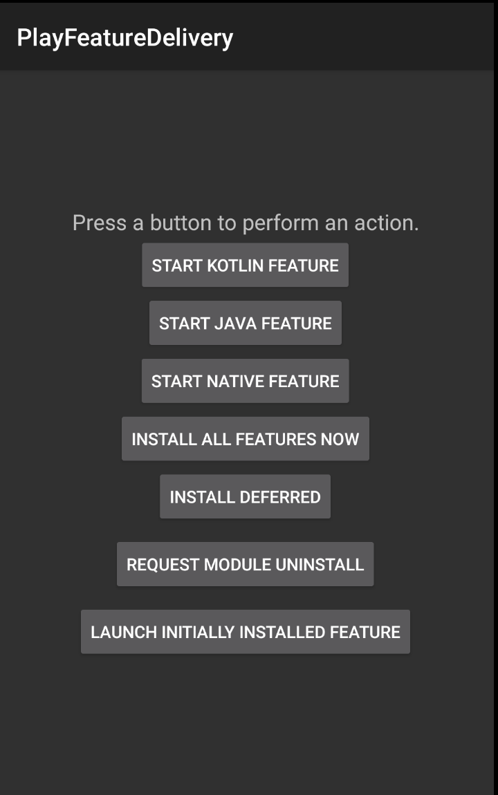

# PlayCore API sample

This sample demonstrates usage of the PlayCore API with gradle build tool system.

Read more at http://g.co/androidappbundle

## Introduction

The sample contains several modules.

`app` -> Contains the base application which always will be installed on device.

The `MainActivity` class demonstrates how to use the API to load and launch features.

The `BaseSplitActivity` abstract class implements the required `SplitCompat.Install()` call
in the `attachBaseContext` method. This allow to launch an activity from a freshly downloaded
dynamic module without having the restart the application.

`features/*` -> Contains features which can be downloaded on demand using the PlayCore API.

Each feature has some distinctly unique characteristics.

* `features/kotlin` -> Feature written in Kotlin and will be available on-demand
* `features/java` -> Feature written in Java and will be available on-demand
* `features/native` -> Feature written in Kotlin using JNI  and will be available on-demand
* `features/initiallInstall` -> Feature written in Kotlin and will be available at install-time

The `AndroidManifest` files in each feature shows how to declare a feature module as part of a dynamic app.

## Screenshot



## Build project with Gradle
|        | **Build command**                  | **Output Path**                                  |
|--------|------------------------------------|--------------------------------------------------|
| Gradle | ./gradlew bundleRelease            | app/build/outputs/bundle/release/app-release.aab |

## Testing dynamic delivery

To test dynamic features locally use [bundletool](https://developer.android.com/studio/command-line/bundletool>bundletool) and follow the below steps:
1. Build bundle file as mentioned in Build project with Gradle section
2. Build apks file: `bundletool build-apks --local-testing --bundle=<path_to_aab>  --output=<path_to_apks>`
   _Make sure to include  --local-testing flag_
3. Connect to the device/emulator
4. Install apks: `bundletool install-apks --apks=<path_to_apks>`

_This will generate and install multiple apks on the connected device. Note the ***apk(s) generated for the dynamic features***_
```
Pushed "/sdcard/Android/data/com.sample.buck.playfeaturedelivery/files/local_testing/initialInstall-xxhdpi.apk"
Pushed "/sdcard/Android/data/com.sample.buck.playfeaturedelivery/files/local_testing/initialInstall-master.apk"
Pushed "/sdcard/Android/data/com.sample.buck.playfeaturedelivery/files/local_testing/java-xxhdpi.apk"
Pushed "/sdcard/Android/data/com.sample.buck.playfeaturedelivery/files/local_testing/java-master.apk"
Pushed "/sdcard/Android/data/com.sample.buck.playfeaturedelivery/files/local_testing/kotlin-xxhdpi.apk"
Pushed "/sdcard/Android/data/com.sample.buck.playfeaturedelivery/files/local_testing/kotlin-master.apk"
Pushed "/sdcard/Android/data/com.sample.buck.playfeaturedelivery/files/local_testing/native-xxhdpi.apk"
Pushed "/sdcard/Android/data/com.sample.buck.playfeaturedelivery/files/local_testing/native-master_2.apk"
Pushed "/sdcard/Android/data/com.sample.buck.playfeaturedelivery/files/local_testing/native-x86_2.apk"
```

